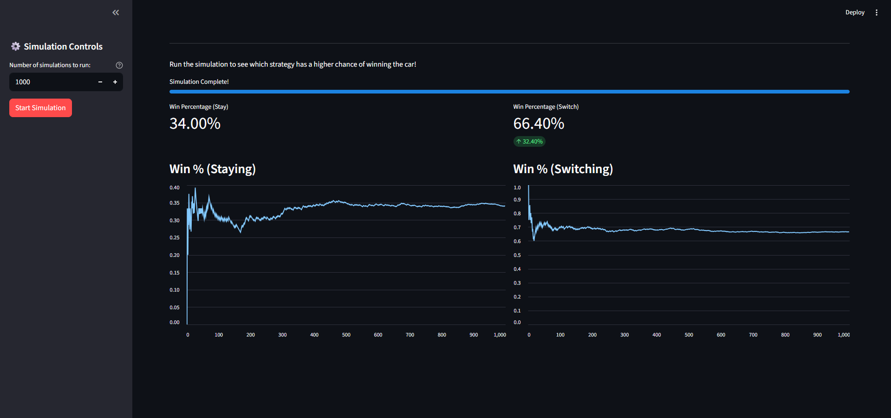

# Monty Hall Problem Simulation

This project is a Python simulation of the famous Monty Hall problem. It demonstrates the counter-intuitive probabilities involved in the game.

## The Monty Hall Problem

The Monty Hall problem is a brain teaser, in the form of a probability puzzle, loosely based on the American television game show "Let's Make a Deal" and named after its original host, Monty Hall.

The problem is stated as follows:

> Suppose you're on a game show, and you're given the choice of three doors: Behind one door is a car; behind the others, goats. You pick a door, say No. 1, and the host, who knows what's behind the doors, opens another door, say No. 3, which has a goat. He then says to you, "Do you want to pick door No. 2?" Is it to your advantage to switch your choice?

The simulation shows that it is indeed advantageous to switch doors, with the probability of winning the car being approximately 2/3 when switching, and 1/3 when not switching.

## Web App Simulation

This project includes a web-based simulation built with Streamlit. The interactive UI allows you to visualize the probabilities in real-time.

### Screenshot



### How to Run the Web App

To run the web app, navigate to the `src` directory and execute the `app.py` script using Streamlit:

```bash
streamlit run app.py
```

## Command-Line Simulation

### How to Run the Simulation

To run the command-line simulation, navigate to the `src` directory and execute the `monty_hall.py` script from your terminal:

```bash
python monty_hall.py
```

### The Code

The simulation is implemented in the `monty_hall.py` file. It consists of two main functions:

- `monty_hall_game(switch_doors)`: Simulates a single round of the Monty Hall game.
- `simulate_game(trials)`: Simulates the game for a given number of trials and calculates the winning percentages for both switching and not switching.

The script runs 10,000 trials by default and prints the winning percentages for both strategies.

### Expected Output

When you run the script, you will see an output similar to the following:

```
Winning percentage without switching doors: 33.33%
Winning percentage with    switching doors: 66.67%
```

This output demonstrates that switching doors significantly increases the probability of winning the car.